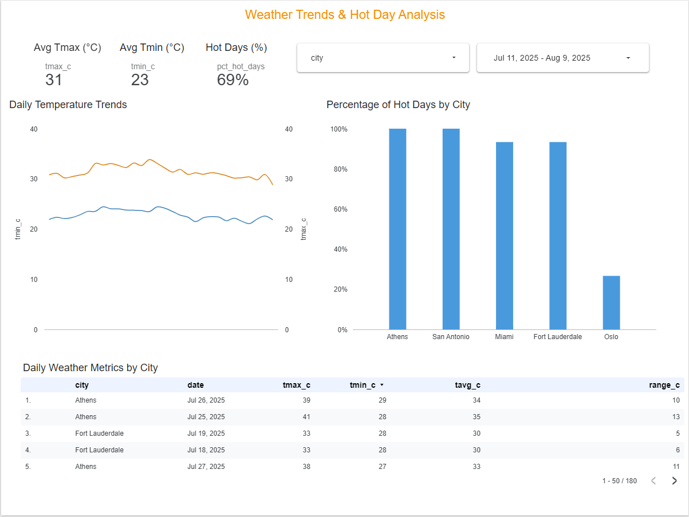

# 🌡️ Weather Trends & Hot Day Analysis Dashboard  

This project explores daily temperature patterns across six global cities and analyzes the frequency of "hot days" — days with a maximum temperature above 30°C.  
The goal was to build a clean, interactive dashboard that shows both average temperatures and the percentage of hot days, using real daily weather data.

---

## 📌 Project Motivation  
As climate change and extreme weather events become more frequent, understanding how often certain cities experience high temperatures is critical — for city planners, public health officials, and environmental researchers alike.  

I wanted to explore how a data analyst could take raw weather data and transform it into actionable insights using Python for preprocessing and Looker Studio for visualization.  

This project also gave me the chance to practice **end-to-end analysis**: cleaning real-world data, calculating meaningful KPIs, and designing a dashboard that is clear, interactive, and visually consistent.

---

## 🛠 Tools & Methods  

**Data Source:** City-level daily weather dataset (Tmax, Tmin, Tavg) covering multiple cities and dates.  

**Cleaning & Preparation:**  
- Removed missing and invalid values  
- Standardized column formats and units (°C)  
- Created a calculated field `hot_date_calc` to flag hot days (`Tmax > 30°C`)  
- Aggregated results by city and date  

**Analysis:**  
- Calculated average Tmax and Tmin per city  
- Calculated % of hot days per city  
- Prepared summary statistics for KPI cards  

**Visualization (Looker Studio):**  
- KPI cards: Avg Tmax, Avg Tmin, % Hot Days  
- Line chart: Temperature trends over time  
- Bar chart: % Hot Days by city  
- Interactive filters for city and date range  
- Drill-down data table  

---

## 📊 Dashboard Overview  

The Looker Studio dashboard includes:  
- **KPI Cards** for quick insight into maximum, minimum, and hot day frequency  
- **Line Chart** showing temperature trends  
- **Bar Chart** ranking cities by percentage of hot days  
- **Interactive Filters** for flexible exploration  
- **Data Table** for detailed city/date breakdown  

**Dashboard Preview:**  

---

## 💡 Key Insights  
- Athens and San Antonio had **100% hot days** in the dataset period  
- Fort Lauderdale and Miami had over **93% hot days**  
- Copenhagen recorded **0% hot days** during the period  
- Oslo saw occasional hot days (~26%)  

---

## 📁 Files Included  
- `city_weather_summary.csv` – Cleaned dataset  
- `weather_analysis.ipynb` – Python preprocessing notebook  
- `weather_dashboard.pdf` – PDF export of the final dashboard  
- `weather_dashboard.png` – Screenshot for quick viewing  

---

## 🚀 What I Learned  
- How to transform raw weather data into meaningful KPIs  
- How to calculate percentages and ratios for business-style dashboards  
- How to design a consistent, recruiter-friendly dashboard in Looker Studio  
- How small formatting choices (e.g., % display, axis labels) impact readability  

---

## 📦 Optional Dependencies  
📁 To view the Looker Studio dashboard live:  
https://lookerstudio.google.com/reporting/6623fa7f-3421-4e5b-ace9-958b0532f6b8  

